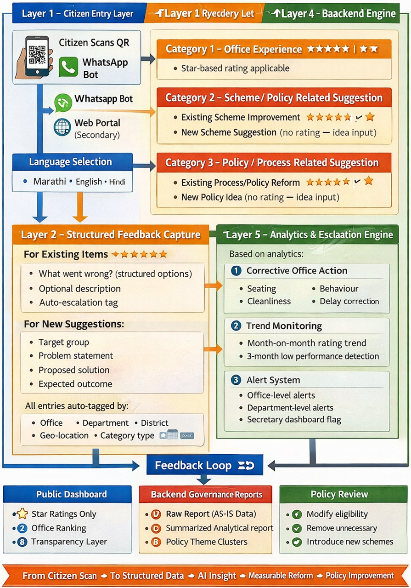
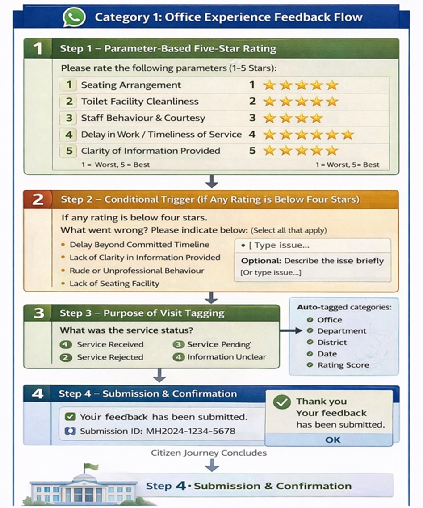
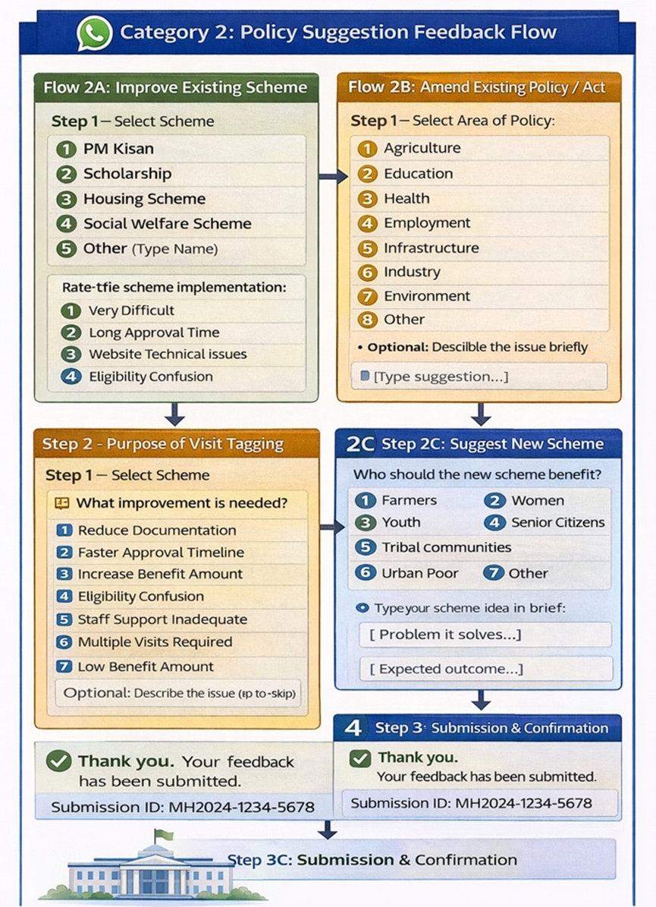
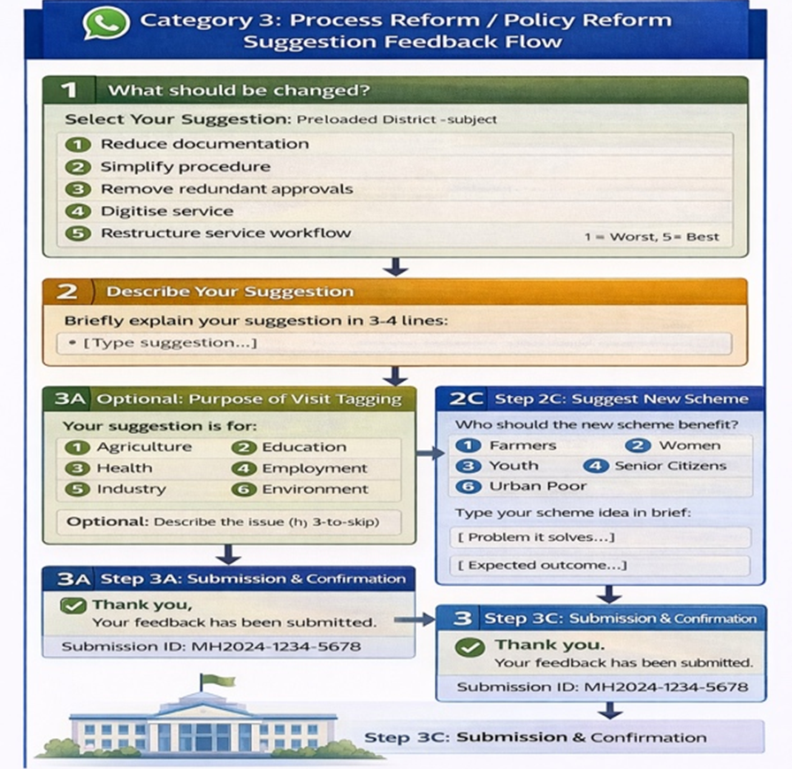

**MAHARASHTRA REAL-TIME CITIZEN EXPERIENCE & GOVERNANCE EXCELLENCE SYSTEM**

**(M-RCEGES)**

_A QR-Based, Citizen-Centric Governance Intelligence Reform Engine_

**Department of Administrative Innovation, Excellence and**

**Good Governance, Government of Maharashtra**

## 1\. Introduction

Every day, lakhs of citizens across Maharashtra visit Government offices from Gram Panchayats and Taluka offices to Municipal Corporations, Police Stations, Primary Health Centres, Revenue Offices and District Collectorates. These visits are often for essential services: income certificates, land records, welfare schemes, licenses, health services, pensions, or police assistance.

While the Government of Maharashtra has undertaken significant reforms in digitisation, service delivery, and transparency, the lived experience of citizens at the field level continues to shape public perception of governance. Cleanliness of facilities, availability of seating, clarity of information, behaviour of staff, waiting time, and ease of service completion are determinants of trust.

The GR dated 04th February, 2026 directive mandating structured visitor feedback in all Government offices was a historic step toward institutionalising citizen voice. It signalled that governance must listen, it should be proactive and not reactive on the foundations of Good Governance.

**The present proposal seeks to take that reform to its logical next stage.**

The Maharashtra Real-Time Citizen Experience & Governance Excellence System (M-RCEGES) proposes a simple yet transformative solution: a QR-based, real-time digital feedback mechanism that converts every citizen visit into structured governance intelligence.

_This initiative does not replace existing systems. It strengthens them. It connects citizen experience directly with administrative accountability and policy refinement._

This initiative will repel positive impact on Ease of doing Business, Ease of Living, CPGRAMS, Aaple Sarkar Grievance Portal, District Good Governance Index, and enhance citizen trust.

## 2\. The Need for a Real-Time Citizen Experience System

Maharashtra has successfully implemented multiple governance reforms including the Right to Public Services Act, Aaple Sarkar 2.0, state-wide e-Office adoption, and the District Good Governance Index (DGGI). These initiatives have significantly improved transparency and efficiency.

However, a structural gap remains.

Traditional grievance redressal systems operate after dissatisfaction has accumulated. They respond to complaints but do not always prevent dissatisfaction from occurring. They address individual cases but may not always detect systemic issues early.

In many cases, citizens experience avoidable discomfort unclean toilets, lack of seating, long waiting times, unclear guidance, or multiple document requirements. Even when the scheme is well-designed, the last-mile experience determines the perception of government effectiveness.

M-RCEGES is designed as a preventive governance mechanism. It captures experience immediately after service delivery, allowing administrators to act before small irritations become large grievances.

## 3\. Vision and Core Philosophy

The core philosophy of M-RCEGES is simple:

Every citizen interaction is a measurable governance event.

By measuring experience in real time, governance becomes:

- More responsive.
- More accountable.
- More evidence-based.

The system operates on three foundational principles:

- First, citizen dignity is a governance metric. Basic amenities and respectful behaviour are not optional. They are essential components of public service.
- Second, governance must be measurable. What is not measured cannot be improved.
- Third, reform must be continuous. Policy and administrative processes should evolve based on structured citizen input. **_Change is the only constant to achieve Maximum Governance Minimum Government._**

## 4\. Dual Transformation Governance Excellence Model

M-RCEGES is designed to create impact at two levels.

**Immediate Field-Level Transformation**

- At the office level, the system provides real-time visibility of citizen ratings. If seating is inadequate, toilets are unclean, or behaviour is rated poorly, the office head becomes aware immediately.
- Small corrective measures can be implemented within days or weeks.
- This creates micro-level accountability and visible responsiveness. Over time, citizens begin to experience improved service standards and regain trust in public institutions.
- Structural Policy and Process Reform

Beyond amenities, the system captures structured suggestions about policies and schemes. Citizens can indicate if documentation requirements are excessive, if eligibility rules are confusing, or if procedures require multiple visits. When aggregated across districts and departments, these inputs reveal systemic bottlenecks.

Departments can then:

- Simplify documentation.
- Amend operational guidelines.
- Digitise processes.
- Rationalise approval layers.
- Improve scheme communication.
- Rationalise Government Process (RGP)
- Government Process Re-engineering
- Changes in as-is or suggesting new policy

This ensures that policy design, field implementation remain aligned and citizen-centric government.

## 5\. Operational Structure

The system is intentionally simple and scalable. Universal QR Code Deployment at every office (more than 10,000+ across the State) will prominently display large, weather-proof, tamper-evident QR codes at:

- - Main entrance
    - Every service counter / desk
    - Waiting area
    - Near toilets and water points

Scanning the QR opens a simple, WhatsApp chatbot (no app needed, Marathi + English, voice-assisted typing option for citizens).

Each QR is permanently mapped to the existing 10-digit DDO Code from the BEAMS (Budget Estimation, Allocation & Monitoring System) of the Finance & Treasury Department already unique for every drawing & disbursing office in the State. This ensures seamless integration with existing financial and administrative systems at zero extra cost.

The citizen selects one of **three categories**:

- Office Experience
- Existing Scheme or New Scheme Suggestion
- Current Policy / New Policy / Process Reform Suggestion

## 6\. Operational Detailed Citizen Flow

## 7\. Detailed Category Wise Flow

**Category 1-** **Office Experience**\-

The citizen rates parameters such as seating, cleanliness and facilities, help received, behaviour of officers and staff, waiting time, and overall satisfaction. A five-star rating between one and five shall be mandatory under this category along with optional remarks.

| **Step** | **Question (Citizen Sees)** | **Answer Type** | **Direct Impact Area** |
| --- | --- | --- | --- |
| 1   | Help Desk available? | Yes/No + Photo | Guidance |
| 2   | Citizen Charter & Job Chart displayed? | Yes/No/Partially | Transparency |
| 3   | Entrance map of all desks available? | Yes/No | Easy navigation |
| 4   | Seating comfortable for visitors? | 1-5 Stars + Photo | Dignity & Comfort |
| 5   | Drinking water hygienic & available? | Yes/No | Basic amenity |
| 6   | Toilets clean, functional, separate M/W? | 1-5 Stars + Photo | Critical Dignity Issue |
| 7   | Purpose of visit fulfilled? | Fully / Partially / No | Service Outcome |
| 8   | Which service/scheme? (Dropdown 100+ options) | Select | Categorisation |
| 9   | Overall + 4 Sub-ratings (Behaviour, Wait time, Cleanliness, Responsiveness) | 1-5 Stars each | Quantitative Benchmark |
| 10  | Additional comments + "Policy/Scheme related" tag | Text + Checkbox | Policy Revolution Trigger |

## Category 2- Schemes related suggestion-

Citizens may suggest improvements in existing schemes, amendments to schemes, simplification of Acts or Rules, or recommendations for new schemes. A free-text submission shall be mandatory under this category.

## Category 3 - Process Reform

Policy / Procedural or Process Reform Suggestion. Citizens may suggest amendments in existing policy, new policy, reduction of documentation, simplification of procedures, removal of redundant approval layers, introduction of digital processes, or restructuring of service workflows. A free-text submission shall be mandatory. Each submission is automatically tagged to the relevant office, department, and district.

## 6\. Governance Intelligence Engine

The strength of the initiative lies in structured backend processing. The **system automatically calculates a Monthly Office Experience Score** for each office. It also computes rolling averages to detect sustained trends rather than reacting to isolated fluctuations.

Advanced analytics tools cluster textual feedback to identify recurring themes such as documentation burden, delay in approvals, lack of clarity, or behavioural concerns, etc.

AI modules will perform sentiment analysis on textual submissions and **classify issues into behavioural concerns, delays, documentation burden, infrastructure deficiencies, digital service gaps, and policy inadequacies.**

Trend detection mechanisms shall identify sudden rating drops, recurring keywords across multiple offices, district-wide patterns, and department-specific systemic concerns.

Policy clustering modules shall aggregate suggestions into structured themes such as policy amendments, procedural simplification, digital reforms, and legislative review requirements. A quarterly Citizen Reform Docket shall be auto generated for review by Department Secretaries and the Chief Secretary.

| **Mechanism** | **Action** | **Long-Term Impact** |
| --- | --- | --- |
| Policy-Tagged Feedback | Routed to Departments automatically | Continuous policy learning |
| Departmental PMU (4-5 officers + analysts) | Data + survey + field research | Evidence-backed corrections |
| As-Is Gap Studies | Identify documentation burden, bottlenecks | Scheme simplification |
| Citizen Pain-Point Analysis | Design new schemes based on demand | Responsive governance |

Artificial intelligence tools assist in identifying patterns but do not replace administrative judgment. All reform actions will remain human-led.

## 7\. Star Rating Logic and Office Performance Index

For Office Experience submissions, the system shall calculate a Monthly Office Experience Score (OMES), defined as the average of all valid star ratings received during the month. Additionally, the system shall compute three-month and six-month rolling averages and detect trend variations. These metrics shall form the basis of escalation and recognition mechanisms.

## 8\. Data Integrity and Safeguards

To maintain credibility, safeguards are embedded:

- Rate-limiting mechanisms prevent misuse.
- Statistical validation ensures awards are data-based.
- Minimum submission thresholds apply before escalation.
- Privacy compliance is ensured under data protection norms.
- Only aggregated data is displayed publicly.

These measures protect both citizens and administrators.

## 9\. Structured Escalation Framework

To ensure accountability, a structured escalation matrix is defined. If an office consistently records low ratings, the issue is escalated in stages:

**Escalation of Category 1 will be till Level 1**

**Escalation of Category 2 and Category 3 will be till Level 3**

**Level 0** shall be the Office Head. If the monthly rating falls **below 3 stars** or shows a significant negative trend, an alert shall be issued with a one-month improvement window.

**Level 1** shall be the Administrative Head of the Judi striction - District Collector/ Municipal Commissioner/ Commissioner of Police / Superintendent of Police, etc.

If ratings remain below three stars for three consecutive months or no improvement is recorded after Level 0 intervention, escalation shall occur with a two-month corrective window and compulsory field visit.

**Level 2** shall be the Divisional Commissioner including concerned departments Director/ Commissioner

If ratings remain below threshold for five consecutive months or repeated escalation occurs, the matter shall be escalated for structured review and mandated with a compulsory visit

**Level 3** shall be the Guardian Secretary. If the office continues below acceptable thresholds for seven consecutive months or systemic district-level decline is observed, senior-level review shall be mandated with a compulsory field visit.

Each level has a defined action window and must upload corrective action details into the system. This ensures fairness, transparency, and measurable improvement.

## 10\. Certificate and Recognition Model

After stabilisation, high-performing institutions / Offices will be recognised through structured awards such as:

- Best Gram Panchayat
- Best Municipal Corporation
- Best Municipal Council
- Best District Collectorate
- Best Police Commissionerate
- Best Superintendent of Police
- Fastest Improving District

Recognition promotes healthy competition and institutional pride.

Following is the evaluation criteria,

- Offices maintaining ratings of 4.5 stars or above for three consecutive months shall automatically receive a Citizen Excellence Certificate along with dashboard recognition and a **"Citizen-Friendly Office"** badge.
- Offices remaining below three stars for four consecutive months shall receive a Service Improvement Advisory.
- If escalation reaches Divisional level, a formal Citizen Service Alert shall be generated for structured monitoring.

## 11\. Governance Structure

A State-Level Steering Committee shall oversee implementation, chaired by senior administrative leadership. Major departments will/ may establish small Policy Management Units to analyse policy-tagged suggestions and respond within defined timelines. **PMU Quarterly reviews will ensure that feedback translates into reform.**

The system shall automatically trigger escalation alerts, flag documentation-heavy services, identify bottleneck processes, generate reform alerts for the Administrative Innovation Cell (AIEGG), produce **monthly district governance reports**, and update hierarchical dashboards accessible to concerned authorities.

## 12\. Integration with Strategic Platforms

Aggregated citizen experience indicators will be integrated into the Chief Minister's Dashboard, providing leadership with real-time governance pulse insights.

Additionally, a new Citizen Office Experience Index will be introduced as a indicator under the District Good Governance Index framework.

Citizen satisfaction thus becomes a formal performance metric.

**13\. Accountability & Escalation Matrix**

| **Time Frame** | **Responsible Authority** | **Action Required** | **Escalation Trigger** |
| --- | --- | --- | --- |
| **0-30 Days** | Office In-charge | Fix basic issues (cleanliness, water, signage, help desk) | Daily low ratings |
| **0-3 Months** | HOD (Tahsildar / BDO / MO / EE etc.) | Demonstrable improvement in low-rated parameters | < 3-star sustained average |
| **3-6 Months** | District Collector / CEO ZP / Divisional Commissioner | Administrative review + inspection | < 20% improvement |
| **Beyond 6 Months** | Principal Secretary / ACS | Departmental audit + CM-level review | Continued poor performance |

## 14\. Outputs

The system is expected to reduce grievance inflow by identifying dissatisfaction early. By clustering procedural complaints, it will enable structured Government Process Re-engineering and Rationalisation of Government Processes. Aggregated citizen suggestions shall create a continuous pipeline for policy improvement and administrative modernization.

The five-star rating shall function as a Citizen Experience Indicator and may be integrated into District Good Governance Index and **Chief Ministers Dashboard** as a measurable performance parameter. The initiative will also institutionalize a recognition-based administrative culture balancing accountability and appreciation.

## 15\. Expected Outcomes

Within one year, the initiative is expected to produce:

- Significant improvement in office ratings.
- Reduction in amenity complaints.
- Policy refinements based on citizen input.
- Reduced documentation burden.
- Improved behavioural standards.
- Enhanced public trust.
- Reduction in Grievances.
- Continuous feedback for process reengineering and rationalisation.

## 16\. Strategic Significance

M-RCEGES transforms the traditional suggestion box into a governance excellence engine.

This initiative transforms suggestion collection into governance intelligence, intelligence into reform triggers, reform into measurable administrative improvement, and improvement into enhanced citizen trust. It establishes a structured, AI-enabled, escalation-backed governance architecture for Maharashtra and marks a shift from reactive grievance redressal to proactive governance reform. It ensures that governance is not measured only by expenditure or scheme announcements, but by the lived experience of citizens.

It positions Maharashtra as a national leader in real-time citizen-centric governance.

- It is simple.
- It is scalable.
- It is measurable.
- It is replicable across India.

Most importantly, it institutionalises dignity in governance.

## 17\. Alignment with State Vision

The initiative aligns with Viksit Maharashtra 2047, Digital Maharashtra, Ease of Living objectives, Minimum Government Maximum Governance principles, the District Good Governance Index framework, and the broader agenda of Administrative Innovation, Reforms and Good Governance to achieve ExcellC:\Users\Riddhish\Desktop\gov-feedback-bot\Gov-System.mdence.
